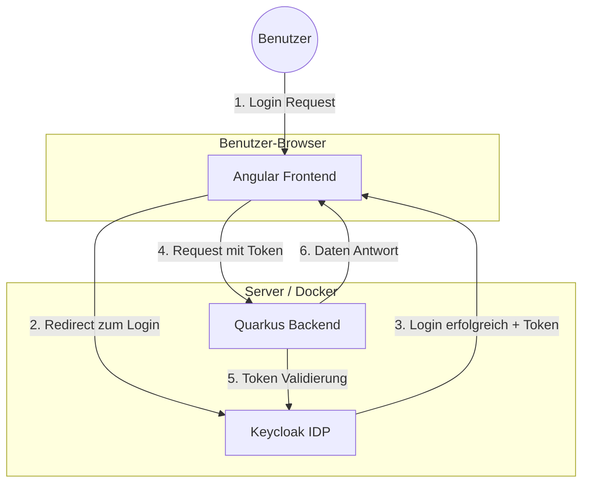

# IDP-Demo: Keycloak Integration 🛡️

Herzlich willkommen zu diesem Demo-Projekt! Hier lernst du, wie man eine moderne Web-Applikation mit einem **Identity Provider (IDP)** absichert.

## 🎯 Zweck des Projekts
Dieses Projekt dient als **Vorlage und Lern-Beispiel**. Es zeigt, wie man:
1. Eine Benutzeranmeldung über **Keycloak** realisiert.
2. Ein **Angular-Frontend** so konfiguriert, dass es nur für angemeldete Benutzer zugänglich ist.
3. Ein **Quarkus-Backend** absichert, sodass es nur gültige Token ("Eintrittskarten") akzeptiert.
4. Das alles lokal mittels **Docker** startet.

---

## 🏗️ Das Zusammenspiel (Architektur)

Das folgende Diagramm zeigt vereinfacht, wie die Komponenten miteinander "sprechen":



1. **Benutzer** möchte auf die App zugreifen.
2. **Frontend** leitet den Benutzer zu **Keycloak** weiter.
3. Nach dem Login erhält das Frontend einen **Token** (JWT).
4. Das Frontend sendet diesen Token bei jeder Anfrage an das **Backend** mit.
5. Das **Backend** prüft beim IDP (oder via Zertifikat), ob der Token echt ist.
6. Wenn alles passt, liefert das Backend die **Daten**.

---

## 🔑 Keycloak in diesem Projekt

Wir verwenden **Keycloak** als zentralen Speicherort für Benutzer und Rechte.
- **Vorteil**: Du musst Passwörter nicht selbst in deiner Datenbank speichern. Keycloak kümmert sich um Sicherheit, "Passwort vergessen"-Funktionen und vieles mehr.
- **Konfiguration**: In diesem Projekt wird Keycloak automatisch mit einem `demo-realm` und zwei Clients vorkonfiguriert:
    - `angular-client`: Für die Anmeldung im Browser.
    - `quarkus-service`: Für die Absicherung der Schnittstellen.

---

## 🛠️ Die Komponenten im Detail

### 1. UI (Angular Frontend)
- **Technik**: Angular + Keycloak Angular Library.
- **Aufgabe**: Sorgt dafür, dass der "Login"-Button erscheint und der Token sicher im Browser verwaltet wird.
- **Config**: Findest du in `src/environments/environment.ts`.

### 2. Backend (Quarkus)
- **Technik**: Java mit Quarkus (OIDC Extension).
- **Aufgabe**: Prüft den "Authorization"-Header bei eingehenden Anrufen. Nur wer einen gültigen Token hat, darf die API benutzen.
- **Config**: Findest du in `src/main/resources/application.properties`.

### 3. IDP (Keycloak)
- **Technik**: Keycloak (läuft in Docker).
- **Aufgabe**: Die zentrale Instanz für Identität.

---

## 🚀 Wie du das in eigenen Projekten verwendest

Wenn du dieses Muster (Pattern) für dein eigenes Projekt nutzen möchtest, gehe so vor:

1. **IDP wählen**: Nutze Keycloak (lokal/selbst gehostet) oder Dienste wie Auth0 / Azure AD. alle nutzen den gleichen Standard (**OIDC/OAuth2**).
2. **Frontend absichern**:
    - Installiere eine OIDC-Library (z.B. `oidc-client-ts` oder frameworks-spezifische Libs).
    - Schütze deine Routen mit einem **AuthGuard**.
3. **Backend absichern**:
    - Nutze eine OIDC/JWT Extension deines Frameworks (Quarkus, Spring Boot, Node.js Passport).
    - Konfiguriere die `issuer-url`, damit das Backend weiß, welchem IDP es vertrauen darf.
4. **Token mitschicken**: Achte darauf, dass dein Frontend den Token im Header mitschickt: `Authorization: Bearer <TOKEN>`.

---

## 🏃 Schnellstart
Stelle sicher, dass Docker installiert ist, und führe aus:
```bash
docker-compose up -d
```
Anschließend kannst du Keycloak unter `http://localhost:8080` und die App (sobald gestartet) erreichen.
