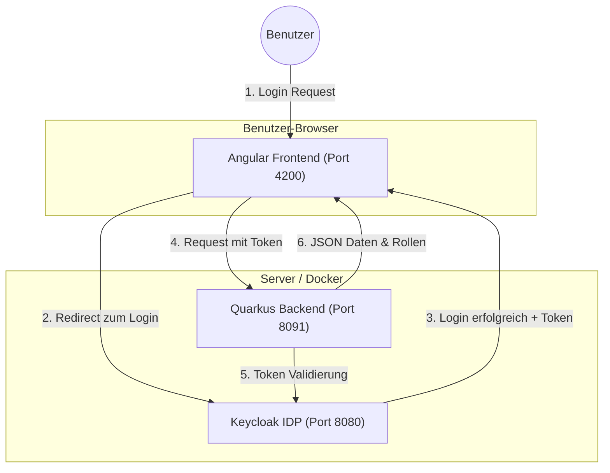

# IDP-Demo: Keycloak Integration 🛡️

Herzlich willkommen zu diesem Demo-Projekt! Hier lernst du, wie man eine moderne Web-Applikation mit einem **Identity Provider (IDP)** absichert.

## 🎯 Zweck des Projekts
Dieses Projekt dient als **Vorlage und Lern-Beispiel**. Es zeigt, wie man:
1. Eine Benutzeranmeldung über **Keycloak** realisiert.
2. Ein **Angular-Frontend** so konfiguriert, dass es nur für angemeldete Benutzer zugänglich ist.
3. Ein **Quarkus-Backend** absichert, sodass es nur gültige Token ("Eintrittskarten") akzeptiert.
4. Das alles lokal mittels **Devbox** und **Docker** startet und entwickelt.

---

## 🏗️ Aktuelle Architektur & Ports
Das Projekt besteht aus drei Hauptkomponenten:
- **UI (Angular Frontend)**: Port `4200`
- **Backend (Quarkus)**: Port `8091`
- **IDP (Keycloak)**: Port `8080`

Das folgende Diagramm zeigt vereinfacht, wie die Komponenten miteinander "sprechen":



---

## 🚀 Neue Features seit 2025
- **Zoneless Angular**: Nutzt `provideZonelessChangeDetection` anstelle der traditionellen `zone.js` Logik.
- **Modernes Styling**: Aufgewertetes Design für die Demo mit passenden Badges.
- **Backend-Demo-Button**: Zeigt direkt die vom Backend stammenden Informationen, Rollen und den Benutzernamen an.

---

## 🔑 Keycloak in diesem Projekt (Version 26.1.1)

Wir verwenden **Keycloak** als zentralen Speicherort für Benutzer und Rechte.
- **Datenbank**: Nutzt eine dedizierte Postgres-Datenbank (`postgres:15`).
- **Feature**: Der `token-exchange` ist standardmäßig aktiviert.
- **Konfiguration**: In diesem Projekt wird Keycloak automatisch mit einem `demo-realm` und zwei Clients vorkonfiguriert:
    - `angular-client`: Für die Anmeldung im Browser.
    - `quarkus-service`: Für die Absicherung der Schnittstellen.

---

## 🛠️ Die Komponenten im Detail

### 1. UI (Angular Frontend) - Version 20.3.17
- **Technik**: Standalone Zoneless Angular + `angular-oauth2-oidc`.
- **Aufgabe**: Sorgt dafür, dass der "Login"-Button erscheint und der Token sicher im Browser verwaltet wird.
- **Ersetzung**: Es wird nun `angular-oauth2-oidc` statt der älteren "Keycloak Angular Library" oder `keycloak-js` genutzt.

### 2. Backend (Quarkus) - Version 3.15.1
- **Technik**: Java mit Quarkus und `quarkus-oidc`.
- **Aufgabe**: Prüft den "Authorization"-Header bei eingehenden Anrufen (`@Authenticated`). Die API prüft zudem auf Rollen wie `@RolesAllowed("user")`.
- **Rückgabe**: Sendet eine JSON-Response zurück, die die Rollen und den extrahierten Username beinhaltet.

---

## 🔐 OAuth-Initialisierung & Auto-Login

Der Authentifizierungsfluss mit `angular-oauth2-oidc` wird in `oauth-init.ts` orchestriert:
1. **Discovery**: Die App lädt die Konfiguration des IDP über `loadDiscoveryDocumentAndTryLogin()`.
2. **Auto-Login**: Liegt kein gültiges Access-Token vor, startet sie automatisch den Login (`initLoginFlow()`).
3. **Silent Refresh**: Für bestehende Sitzungen gibt es einen automatischen Refresh im Hintergrund über das versteckte Iframe-Template in `silent-check-sso.html`.

---

## 📦 Devbox-Entwicklungsumgebung

Das Projekt nutzt [Devbox](https://www.jetpack.io/devbox) (Nix) als primäres Isolations- und Ausführungssystem. Dadurch entfällt ein komplexes Setup. Alle Abhängigkeiten (wie Node, JDK, Maven) werden von Devbox bereitgestellt.

### Wichtige Scripts:
- `devbox run install:all`: Installiert alle Abhängigkeiten (Frontend, E2E, Playwright Browser).
- `devbox run infra`: Startet Backend-Infrastruktur (`docker-compose` mit Keycloak & Postgres).
- `devbox run frontend`: Startet die Angular CLI auf Port 4200.
- `devbox run backend`: Startet Quarkus im Live-Coding Dev-Mode auf Port 8091.

---

## 🏃 Schnellstart
Stelle sicher, dass **Devbox** und **Docker** installiert sind, dann nutze die folgenden Skripte in getrennten Terminals:

```bash
# 1. Infrastruktur (Keycloak + DB) starten (Dauert kurz bis es bereit ist)
devbox run infra

# 2. Alle Abhängigkeiten installieren
devbox run install:all

# 3. Backend starten
devbox run backend

# 4. Frontend starten
devbox run frontend
```
Anschließend kannst du das Frontend unter `http://localhost:4200` und Keycloak unter `http://localhost:8080` (Benutzer: admin/admin) erreichen.

---

## 🧪 End-to-End Tests mit Playwright
Das Projekt verfügt über vollständige automatische UI-Tests:
```bash
devbox run test:e2e
```
Playwright öffnet dafür den Chromium-Browser und navigiert durch den echten Login-Flow des Keycloak-Servers und verifiziert die Quarkus Backend-Calls.
